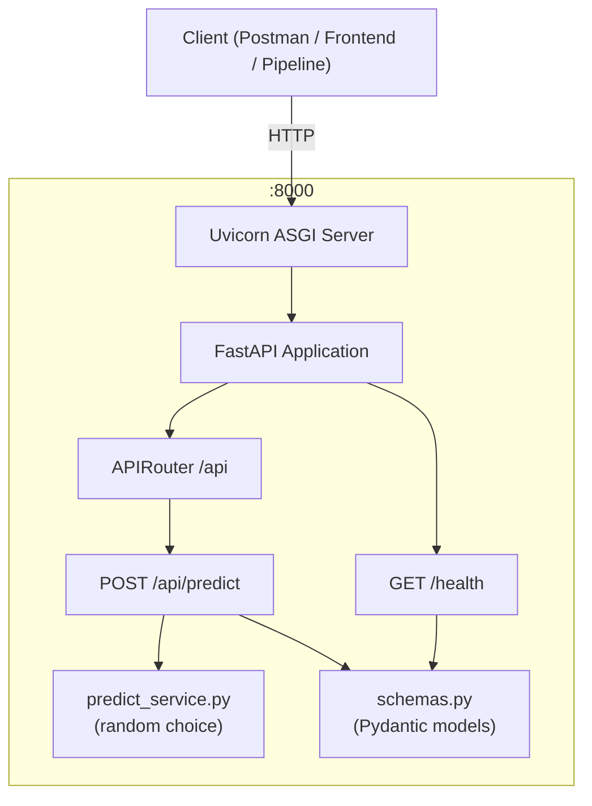

# Design Document: fastapi-mock-predict

## Overview

`fastapi-mock-predict` là một mock HTTP service xây dựng bằng FastAPI, chạy trong Docker container. Service cung cấp endpoint `POST /api/predict` trả về kết quả phân loại ngẫu nhiên (`"attack"` hoặc `"normal"`) và endpoint `GET /health` để kiểm tra trạng thái. Mục tiêu là tạo môi trường mock ổn định cho kiểm thử tích hợp mà không cần model ML thực tế.

Các quyết định thiết kế chính:
- **FastAPI** được chọn vì tích hợp sẵn OpenAPI/Swagger UI, validation tự động qua Pydantic, và hiệu năng cao.
- **Pydantic v2** cho schema validation — FastAPI 0.100+ sử dụng Pydantic v2 mặc định.
- **Python `random` module** đủ dùng cho mock prediction (không cần thư viện ML).
- **Uvicorn** làm ASGI server bên trong container.

---

## Architecture



Luồng xử lý request `POST /api/predict`:
1. Client gửi JSON body đến Uvicorn.
2. FastAPI tự động validate body qua Pydantic schema `PredictRequest`.
3. Nếu validation thất bại → trả về `422 Unprocessable Entity` tự động.
4. Nếu hợp lệ → `predict_service.predict()` trả về `"attack"` hoặc `"normal"` ngẫu nhiên.
5. Response được serialize thành `PredictResponse` và trả về `200 OK`.

---

## Components and Interfaces

### Cấu trúc thư mục

```
fastapi-mock-predict/
├── app/
│   ├── __init__.py
│   ├── main.py            # FastAPI app instance, mount router, /health
│   ├── routers/
│   │   ├── __init__.py
│   │   └── predict.py     # POST /api/predict handler
│   ├── schemas.py         # Pydantic request/response models
│   └── services/
│       ├── __init__.py
│       └── predict_service.py  # Business logic (random prediction)
├── tests/
│   ├── __init__.py
│   ├── test_predict.py
│   └── test_health.py
├── Dockerfile
├── docker-compose.yml
├── requirements.txt
└── README.md
```

### `app/schemas.py`

```python
from pydantic import BaseModel
from typing import Optional, List, Literal

class PredictRequest(BaseModel):
    features: List[float]
    request_id: Optional[str] = None

class PredictResponse(BaseModel):
    status: Literal["attack", "normal"]
    request_id: Optional[str] = None

class HealthResponse(BaseModel):
    status: Literal["ok"]
```

### `app/services/predict_service.py`

```python
import random

def predict(features: list[float]) -> str:
    return random.choice(["attack", "normal"])
```

Interface đơn giản, nhận list số thực, trả về string. Dễ thay thế bằng model thực sau này.

### `app/routers/predict.py`

```python
from fastapi import APIRouter
from app.schemas import PredictRequest, PredictResponse
from app.services import predict_service

router = APIRouter()

@router.post("/predict", response_model=PredictResponse)
def predict(payload: PredictRequest) -> PredictResponse:
    result = predict_service.predict(payload.features)
    return PredictResponse(status=result, request_id=payload.request_id)
```

### `app/main.py`

```python
from fastapi import FastAPI
from app.routers.predict import router as predict_router
from app.schemas import HealthResponse

app = FastAPI(title="FastAPI Mock Predict", version="1.0.0")
app.include_router(predict_router, prefix="/api")

@app.get("/health", response_model=HealthResponse)
def health() -> HealthResponse:
    return HealthResponse(status="ok")
```

---

## Data Models

### PredictRequest

| Field        | Type           | Required | Description                        |
|--------------|----------------|----------|------------------------------------|
| `features`   | `List[float]`  | Yes      | Danh sách số thực đầu vào          |
| `request_id` | `str` or null  | No       | ID tùy chọn để trace request       |

Validation rules (tự động bởi Pydantic):
- `features` phải là array — nếu thiếu hoặc sai kiểu → `422`.
- Mỗi phần tử trong `features` phải coercible sang `float` — nếu không → `422`.
- `request_id` nếu có phải là string.

### PredictResponse

| Field        | Type                        | Description                              |
|--------------|-----------------------------|------------------------------------------|
| `status`     | `"attack"` \| `"normal"`    | Kết quả phân loại ngẫu nhiên             |
| `request_id` | `str` or null               | Phản chiếu lại `request_id` từ request  |

### HealthResponse

| Field    | Type    | Description        |
|----------|---------|--------------------|
| `status` | `"ok"`  | Luôn trả về `"ok"` |

---


## Correctness Properties

*A property is a characteristic or behavior that should hold true across all valid executions of a system — essentially, a formal statement about what the system should do. Properties serve as the bridge between human-readable specifications and machine-verifiable correctness guarantees.*

Sau khi phân tích prework, các criteria liên quan đến cấu trúc file (1.x), Docker (5.x), và health check đơn giản (4.x) không phù hợp cho PBT vì không có input variation có ý nghĩa. Các properties dưới đây tập trung vào logic xử lý request của `POST /api/predict`.

**Property Reflection:**
- Criteria 3.1 và 3.2 được hợp nhất: cả hai đều kiểm tra response của valid payload — 3.1 kiểm tra HTTP 200, 3.2 kiểm tra giá trị `status`. Một property duy nhất bao phủ cả hai.
- Criteria 3.5 (invalid features → 422) và 3.6 (no crash on valid payload) là hai properties độc lập, giữ riêng.
- Criteria 3.3 (request_id round-trip) là property độc lập.

---

### Property 1: Valid payload luôn trả về response hợp lệ

*For any* list số thực `features` (bao gồm list rỗng, list dài, giá trị float cực đại/cực tiểu) và `request_id` tùy chọn, khi gửi POST `/api/predict`, service SHALL trả về HTTP `200` với body có trường `status` thuộc `{"attack", "normal"}`.

**Validates: Requirements 3.1, 3.2**

---

### Property 2: request_id được phản chiếu chính xác

*For any* string `request_id` (bao gồm chuỗi rỗng, chuỗi dài, ký tự Unicode, ký tự đặc biệt), khi gửi POST `/api/predict` với `request_id` đó, response SHALL chứa `request_id` có giá trị bằng đúng giá trị đã gửi.

**Validates: Requirements 3.3**

---

### Property 3: Invalid features luôn bị từ chối với 422

*For any* giá trị không hợp lệ cho trường `features` (string, null, số nguyên đơn lẻ, list chứa string, object), khi gửi POST `/api/predict`, service SHALL trả về HTTP `422`.

**Validates: Requirements 3.4, 3.5**

---

## Error Handling

| Tình huống | HTTP Status | Response Body |
|---|---|---|
| `features` thiếu | `422` | Pydantic validation error tự động |
| `features` sai kiểu | `422` | Pydantic validation error tự động |
| Body không phải JSON | `422` | FastAPI parse error |
| Mọi request hợp lệ | `200` | `PredictResponse` |
| `GET /health` | `200` | `{"status": "ok"}` |

FastAPI + Pydantic xử lý toàn bộ validation errors tự động — không cần custom error handler cho các trường hợp trên. Service không có external dependencies (DB, network) nên không cần xử lý lỗi kết nối.

---

## Testing Strategy

### Công cụ

- **pytest** + **httpx** (ASGI test client qua `httpx.AsyncClient` hoặc `TestClient` của FastAPI)
- **hypothesis** cho property-based testing (Python PBT library phổ biến nhất)
- Minimum **100 iterations** mỗi property test (mặc định của Hypothesis là 100)

### Unit Tests (example-based)

Tập trung vào các trường hợp cụ thể:

- `GET /health` → `200`, body `{"status": "ok"}`
- `GET /docs` → `200` (Swagger UI available)
- `GET /openapi.json` → schema chứa `PredictRequest` và `PredictResponse`
- POST với `features=[]` (list rỗng) → `200`
- POST thiếu `features` → `422`
- POST với `features="not_a_list"` → `422`
- POST không có `request_id` → response `request_id` là `null`

### Property-Based Tests (Hypothesis)

Mỗi property test phải có comment tag theo format:
`# Feature: fastapi-mock-predict, Property {N}: {property_text}`

**Property 1 — Valid payload luôn trả về response hợp lệ:**
```python
# Feature: fastapi-mock-predict, Property 1: valid payload returns 200 with status in {attack, normal}
@given(
    features=st.lists(st.floats(allow_nan=False, allow_infinity=False)),
    request_id=st.one_of(st.none(), st.text())
)
@settings(max_examples=100)
def test_valid_payload_returns_valid_response(features, request_id): ...
```

**Property 2 — request_id round-trip:**
```python
# Feature: fastapi-mock-predict, Property 2: request_id is echoed back unchanged
@given(request_id=st.text())
@settings(max_examples=100)
def test_request_id_roundtrip(request_id): ...
```

**Property 3 — Invalid features → 422:**
```python
# Feature: fastapi-mock-predict, Property 3: invalid features returns 422
@given(invalid_features=st.one_of(st.text(), st.none(), st.integers(), st.lists(st.text())))
@settings(max_examples=100)
def test_invalid_features_returns_422(invalid_features): ...
```

### Docker Integration Tests

- Build image thành công (không lỗi)
- `docker-compose up` → port 8000 accessible
- `GET /health` qua port 8000 → `200`
- Restart policy `always` được cấu hình trong `docker-compose.yml`
